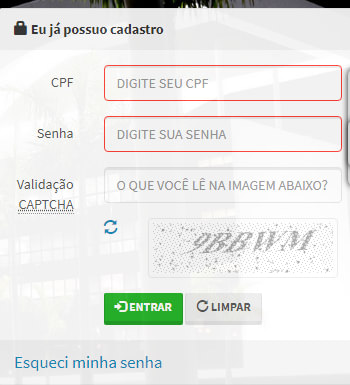
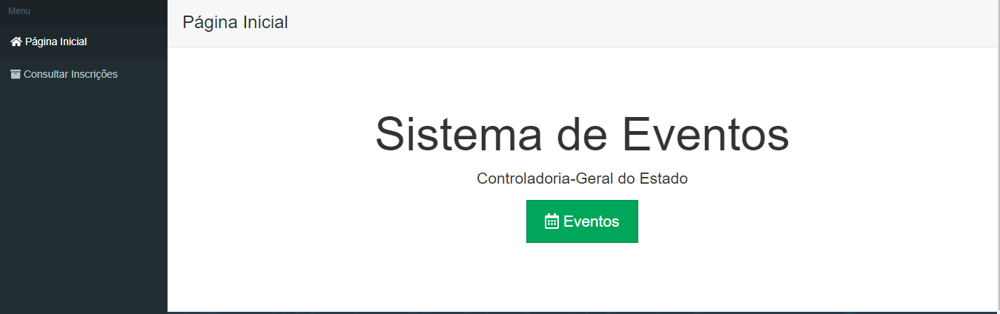
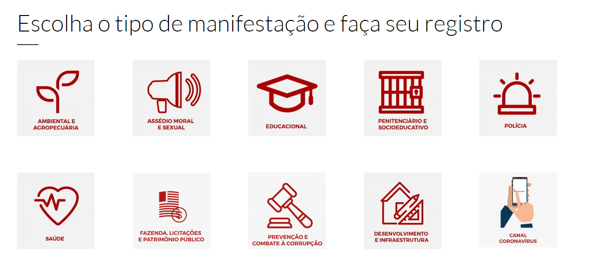

# FAQ CGE

## SISPATRI 

### Como recuperar/alterar a senha do SISPATRI?
Caso o agente já tenha feito o cadastro inicial, mas tenha esquecido sua senha, será possível recuperá-la através do link “Esqueci Minha Senha” na página inicial do [SISPATRI](https://www.sispatri.mg.gov.br/PaginasPublicas/Login.aspx). 

Após clicar no link “Esqueci minha senha”, aparecerá a tela onde deve ser informado o CPF (só números, sem pontuação ou traços), em seguida clique no botão “ENVIAR EMAIL COM INSTRUÇÕES DE RECUPERAÇÃO”.

### Como alterar o e-mail de cadastro no SISPATRI?
Caso seja necessário alterar o e-mail de recuperação de senha de acesso ao SISPATRI, entre em contato com a Unidade de Recursos Humanos do seu órgão/entidade para proceder a alteração.

### Digitei o meu CPF e apareceu a seguinte mensagem: ****O CPF digitado não corresponde a nenhum agente cadastrado****, como devo proceder?
Caso seja o primeiro acesso ao SISPATRI, será necessária a realização de seu cadastro, onde serão confirmados alguns de seus dados e será solicitada a criação de uma senha de acesso através do link “Cadastre aqui” do  [SISPATRI](https://www.sispatri.mg.gov.br/PaginasPublicas/PrimeiroAcesso.aspx).

Caso a mensagem permaneça, entre em contato com a Unidade de Recursos Humanos do seu órgão/entidade para receber orientação acerca dos procedimentos que deverão ser adotados.

### Perdi o prazo para enviar a Declaração de Bens e Valores, como devo proceder?
Entre em contato com a Unidade de Recursos Humanos do seu órgão/entidade para receber orientação acerca dos procedimentos que deverão ser adotados.

### Como retificar a Declaração de bens dos agentes públicos no SISPATRI?
O agente público poderá, por meio de declaração retificadora, alterar ou excluir informações, bem como adicionar dados referentes aos bens e valores que não foram incluídos na declaração originalmente apresentada, podendo ser realizada a qualquer momento do ano corrente da entrega da declaração.

**Atenção:** a declaração retificadora possui a mesma natureza da declaração originalmente apresentada, substituindo-a integralmente, e deverá conter as informações anteriormente declaradas com as alterações e exclusões, bem como, se for o caso, com as informações adicionais.

### Como regularizar a Declaração de Bens dos anos anteriores no SISPATRI?
Entre em contato com  a Unidade de Recursos Humanos do seu órgão/entidade para receber orientação acerca dos procedimentos que deverão ser adotados.

### Quem é obrigado a realizar a Declaração de Bens no SISPATRI?
Estão obrigados a apresentar a declaração de bens e valores todos agentes públicos que exerçam, ainda que transitoriamente ou sem remuneração, por eleição, nomeação, designação, contratação, ou qualquer outra forma de investidura ou vínculo, mandato, cargo, emprego ou função nos órgãos e entidades da Administração Pública do Poder Executivo Estadual.

Não estão obrigados a entregar a declaração de bens e valores os agentes públicos aposentados sem vínculo ativo com o Poder Executivo Estadual e os estagiários. 

### O agente público dispensado de apresentar a declaração anual de imposto de renda deve apresentar a declaração de bens e valores do Estado?
Sim. 
Mantém-se a obrigação de prestar a declaração de bens e valores, na forma da legislação, ainda que isento de prestar a declaração de imposto de renda, uma vez que a declaração de bens e valores tem a função de acompanhar a evolução patrimonial do servidor e não a sua capacidade contributiva para fins de Imposto sobre a Renda.

### Estou de licença/férias/afastado, sou obrigado(a) a realizar a Declaração de Bens no SISPATRI? 
Sim. 
O agente público que se encontrar, a qualquer título, regularmente afastado ou licenciado, **terá o prazo de até dez dias úteis, contados do seu retorno ao serviço**, para entregar a declaração de bens e valores. 

### Qual o prazo para entrega da Declaração de Bens no SISPATRI? 
O período para apresentação da declaração anual de bens e valores terá como referência as datas estipuladas pela Secretaria da Receita Federal do Brasil para a apresentação da Declaração de Ajuste Anual do Imposto de Renda Pessoa Física, estando compreendido pelas seguintes datas:
I – Data-início: a mesma estipulada pela Receita Federal;
II – Data-fim: último dia do mês subsequente ao da data-limite estipulada pela Receita Federal ou, quando este não for dia útil, no primeiro dia útil subsequente.

### Quais os agentes públicos são obrigados a entregar a declaração de bens e valores via sistema eletrônico?
- Os ocupantes de cargos eletivos no Poder Executivo Estadual, os secretários de Estado, dirigentes e autoridades equivalentes dos órgãos e entidades que compõem a Administração Pública do Poder Executivo Estadual;

- Os Agentes públicos ocupantes dos cargos ou investidos nas funções constantes do Anexo II do Decreto nº 46.933/2016.

Os demais agentes públicos poderão entregar a declaração de bens e valores das seguintes formas:
- Formulário próprio (observado o disposto no Anexo I do Decreto nº 46.933/2016);
- Cópia da seção Bens e Direitos da declaração anual de imposto de renda, apresentada à Receita Federal;
- Sistema eletrônico de registro de bens e valores - SISPATRI.

Neste caso, deve-se verificar junto à Unidade de Recursos Humanos do seu órgão/entidade a forma que a declaração deverá ser entregue.  

Outras informações sobre o SISPATRI podem ser solicitadas por meio do endereço eletrônico suporterh.sispatri@cge.mg.gov.br
ou no sítio eletrônico do [SISPATRI](https://www.sispatri.mg.gov.br/PaginasPublicas/Login.aspx).

## PROCESSO ADMINISTRATIVO DISCIPLINAR - PAD (falta revisão da correição)

### Como faço para ter acesso a cópia dos autos de um Processo Administrativo Disciplinar?
Envie um e-mail para: atende.correicao@cge.mg.gov.br, informe os dados do processo e os seus dados.

Após receber o pedido, a equipe da Corregedoria-Geral avaliará o seu pedido e responderá o seu e-mail com as instruções para a disponibilização da cópia.

Caso o processo ainda não esteja finalizado ou caso o solicitante não seja parte dos autos, a equipe poderá recusar a cópia dos autos do Processo.

### Como faço para saber o andamento de um Processo Administrativo Disciplinar?
Envie um e-mail para: atende.correicao@cge.mg.gov.br, informe os dados do processo e os seus dados.

Após receber o pedido, a equipe da Corregedoria-Geral avaliará o seu pedido e informará a fase que se encontra o processo.

### Tenho dúvidas sobre o Manual Prática de Prevenção e Apuração de Ilicítos Administrativos, a quem posso encaminhar a minha dúvida?
Envie um e-mail para: atende.correicao@cge.mg.gov.br, relatando as suas dúvidas. 

O seu e-mail será enviado a área competente na Corregedoria-Geral, que as responderá, por e-mail.

## CONFLITO DE INTERESSE - MEI 
### Servidor Público Estadual pode ser Microempreendedor Indiviudal MEI?
No âmbito da Administração Pública, a constituição de MEI nos moldes da Lei Complementar nº 123/2006 é vedada pela legislação ao servidor público estadual, pois o desempenho das atividades destinadas ao MEI exige, via de regra, pessoalidade e habitualidade no exercício da atividade econômica, incidindo portanto na proibição disciplinar prevista pelo artigo 217, inciso VI, Lei nº 869/1952.

Além disso, caso a constituição de MEI seja justificada pelo agente como forma de viabilizar sua prestação de serviços para determinada instituição, ocultando vínculo de natureza empregatícia, cabe à Corregedoria verificar se a atividade por ele desempenhada não configura conflito de interesses nos moldes da Lei nº. 12.813/2013 e se há compatibilidade com o desempenho das funções referentes ao cargo público, para afastar a ocorrência de ilícito disciplinar.

Presentes indícios de fraude tributária na contratação do MEI, cabe à Corregedoria oficiar aos órgãos competentes para adoção das providências cabíveis no tocante ao recolhimento de verbas previdenciárias e trabalhistas. 

## CERTIFICADOS 
### Como acessar o meu certificado de participação de cursos realizados pela CGE?
Após o término do curso, palestra ou seminário, acesse o sistema CGE Eventos por meio do endereço [Eventos CGE](https://eventos.cge.mg.gov.br/).

Realize o login com o CPF e senha utilizados na inscrição e clique em “Consultar Inscrições”, no menu à esquerda. 

O certificado de cada evento estará disponível na linha correspondente à sua inscrição.

## DENÚNCIA 
### Como faço para realizar uma denúncia?
As denúncias devem ser realizadas por meio do sitío eletrônico da [Ouvidoria-Geral do Estado de Minas Gerais](http://www.ouvidoriageral.mg.gov.br/).

A Ouvidoria é o canal de interlocução entre a sociedade e o Governo. Ela auxilia diretamente o Governador na fiscalização e no aperfeiçoamento dos serviços públicos, para que o cidadão seja, a cada dia, mais bem atendido.

A OGE atua com independência, não é subordinada a nenhum dos poderes do Estado ou a seus membros. A OGE trabalha com imparcialidade, agilidade e transparência.

### Como faço para acompanhar uma denúncia? (texto revisado pela ASSCOM)
Ao entrar no site da [Ouvidoria Geral](www.ouvidoriageral.mg.gov.br) você vai encontrar ícones das ouvidorias temáticas. 

Clique no ícone relativo ao assunto relacionado a sua denúncia. 

Ao registrar a denúncia, você vai receber um número do protocolo para o acompanhamento do processo. Utilize o número do protocolo para acompanhar a sua denúncia.

O prazo para a sua resposta varia entre 30 a 60 dias.

Importante lembrar que sua denúncia pode ser anônima!

## CERTIDÃO NEGATIVA DE ANTECEDENTES FUNCIONAIS 
### Como faço para solicitar uma Certidão Negativa de Antecedentes Funcionais?
Envie um e-mail para: atende.correicao@cge.mg.gov.br.

Informe no e-mail os seguintes dados para emissão da certidão:
- Nome Completo
- CPF
- MASP

## CONCURSO PÚBLICO 
### Quando será realizado Concurso Público para a carreira de Auditor Interno? (texto revisado pela ASSCOM)
Não há, no momento, qualquer previsão para realização de Concurso Público para a carreira de Auditor Interno do Estado de Minas Gerais.

Informamos ainda que não existe uma periodicidade predefinida para a realização de concursos públicos no estado, visto que se pautam pela necessidade e conveniência da administração em fazer novas contratações, observados os limites impostos pela Lei de Responsabilidade de Fiscal.

## PEDIDO DE ACESSO À INFORMAÇÃO
## Como fazer um pedido de acesso à informação ao Governo de Minas?

Você pode utilizar 3 canais diferentes para fazer um pedido de acesso à informação:

**Internet:** Acesse o site do [E-sic](http://www.acessoainformacao.mg.gov.br/sistema/site/index.html?ReturnUrl=%2fsistema%2f). Com o CPF em mãos, preencha o formulário e detalhe o seu pedido de informação.

Assim que a mensagem for enviada, você receberá um número de protocolo. Guarde o número do protocolo, pois com esse número será possível acompanhar a demanda.

**Telefone:** O acesso à informação também poderá ocorrer por atendimento telefônico efetuado pelo LigMinas-155, conforme Decreto nº 45.053, de 6 de março de 2009.

**Presencial:** o atendimento presencial ocorre nas UAI’s, conforme Decreto nº 44.299, de 23 de maio de 2006. 

Nos Municípios onde não houver UAI, o pedido será protocolizado diretamente nos órgaos detentores da informação.

## E se o meu Pedido de Acesso à Informação for negado?
Caso uma solicitação não seja atendida, você tem 10 dias para entrar com o Recurso. Acesse o site do  [E-sic](http://www.acessoainformacao.mg.gov.br/sistema/site/index.html?ReturnUrl=%2fsistema%2f) e faça o pedido de recurso.

**Primeiro recurso:** é analisado pela autoridade superior a do servidor do órgão ou entidade estadual que respondeu formulou a resposta. 

**Segundo recurso:** é analisado pelo Controlador-Geral do Estado.

**Terceiro recurso:** é analisado pela “Comissão Mista de Reavaliação de Informações”.

No caso de omissão de resposta ao pedido de acesso à informação, o requerente também poderá apresentar uma reclamação.

## Quais são os prazos?
O prazo para atendimento das demandas é de 20 dias, prorrogável por mais 10 dias. 

O cidadão tem até 10 dias para registrar um recurso de primeira instância, a partir do envio da resposta. 

O órgão tem até 10 dias para analisar o recurso e apresentar seu parecer.

## CGE
### O que faz a Controladoria-Geral do Estado de Minas Gerais?
Criada em janeiro de 2011 (Lei Delegada nº 180, de 20 de Janeiro de 2011), a Controladoria-Geral do Estado de Minas Gerais atua para prevenir e combater a corrupção na gestão estadual, garantir a defesa do patrimônio público, promover a transparência e a participação social e contribuir para a melhoria da qualidade dos serviços públicos. 

Para que seus objetivos sejam atingidos, a CGE-MG atua em três macrofunções:
- Auditoria (acompanhamento da aplicação dos recursos públicos estaduais); 
- Correição (apuração da conduta de agentes públicos do Estado e aplicação de eventuais penalidades) e;
- Transparência (gestão de políticas de transparência e fomento à participação da sociedade na fiscalização dos gastos públicos).

### Quais as funções da Auditoria?
A Auditoria-Geral tem a missão de acompanhar a aplicação dos recursos públicos estaduais. 

O objetivo das auditorias é promover a eficiência e eficácia na utilização dos recursos públicos, bem como a economicidade e, consequentemente, a efetividade dos programas de governo.

### Qual o horário de atendimento da CGE?
O horário de atendimento ao público é de 8h às 18h, de segunda a sexta-feira. 

Telefone de contato: 3915-8992

## LEI DE ACESSO À INFORMAÇÃO - LAI
### O que é a LAI?
A Lei nº 12.527, sancionada em 2011, regulamenta o direito constitucional de acesso às informações públicas. 

Essa norma entrou em vigor em 16 de maio de 2012 e criou mecanismos que possibilitam, a qualquer pessoa, física ou jurídica solciitar, sem necessidade de apresentar motivo, o recebimento de informações públicas dos órgãos e entidades. 

### Quem deve cumprir a LAI?
A Lei vale para os três Poderes da União, Estados, Distrito Federal e Municípios, inclusive aos Tribunais de Conta e Ministério Público. 

Entidades privadas sem fins lucrativos também são obrigadas a dar publicidade a informações referentes ao recebimento e à destinação dos recursos públicos por elas recebidos. 

Em Minas Gerais, a Lei de Acesso à Informação foi regulamentada pelo Decreto nº 45.969, de 24 de maio de 2012. 

O órgão responsável por fiscalizar e garantir o cumprimento da LAI é a Controladoria-Geral do Estado de Minas Gerais. 

### O que é transparência ativa?
A Lei de Acesso à Informação estabelece que órgãos e entidades públicas devem divulgar, independentemente de solicitações, informações de interesse geral ou coletivo. 

Por exemplo: despesas, transferências ou repasses de recursos financeiros, competências e estrutura organizacional, procedimentos licitatórios, inclusive os respectivos editais e resultado.

## PORTAL DA TRANSPARÊNCIA
### O que é o Portal da Transparência?
O Portal da Transparência do Governo de Minas Gerais é uma ferramenta em 2011 lançada para assegurar a boa e correta aplicação dos recursos públicos. 

O objetivo é aumentar a transparência da gestão pública, permitindo que o cidadão acompanhe e ajude a fiscalizar o uso do dinheiro público. 

A transparência é uma grande aliada no combate à corrupção.

## Quais informações encontro no Portal da Transparência?
O Portal da Transparência do Estado de Minas Gerais reúne as informações requeridas pela Lei de Acesso à Informação, onde qualquer cidadão terá acesso a informações sobre os seguintes itens: 

- Dados institucionais dos órgãos e entidades do Poder Executivo Estadual; 
- Dados gerais para o acompanhamento de programas e ações de órgãos e entidades; 
- Registros de quaisquer repasses ou transferências de recursos financeiros; 
- Registros das despesas; 
- Procedimentos licitatórios, inclusive os respectivos editais e resultados, bem como a todos os contratos celebrados; 
- Formas de solicitação de informação.